# Selina Shin - Portfolio Task

​
[My portfolio site](https://github.com/smijis/smijis.github.io)
​

## Project Requirements

### Content

Add a short paragraph describing the features below. What aesthetic and technical choices did you make?

- ✓ At least one profile picture

  I used object-fit to keep the image in proportion and a border-radius to give it a round border. I also used a container to make it responsive depending on viewport dimensions. This placed the profile picture next to the header on the desktop, but on the mobile, the header goes underneath the profile picture.

- ✓ Biography (at least 100 words)

  I wanted my bio to be centered with large padding on the sides for my desktop version. Therefore, I used text-align, added padding, and also max-width at 1000px so that it would not stretch on wider screens. I also made the font size 4vw, again to make it responsive and only 4% of the viewport width.

- ✓ Functional Contact Form

  I initially used the form html tag; however, to center the form on the webpage, I ended up changing it to a container so I could adjust elements to my liking. I also put the contact form on a separate, third web page.

- ✓ "Projects" section

  I added a second webpage with just my projects. I needed to use a container and flexbox so I could put project one and two next to each other using, and then used flex-wrap to wrap projects 3 and 4 underneath.

- ✓ Links to external sites, e.g. GitHub and LinkedIn.

  I used clickable icons that were linked to my GitHub and LinkedIn pages on the contact web page. As I wanted the icons to be next to the writing, I also used the footer as a container and applied flexbox.
  ​

### Technical

Add a short paragraph describing the features below. What strategies or design decisions did you work from?

- ✓ At least 2 web pages.
- ✓ Version controlled with Git
- ✓ Deployed on GitHub pages.
- ✓ Implements responsive design principles.
- ✓ Uses semantic HTML.

  I created 3 web pages, plus a 4th if you click one of the project image links (but it is not included in the navigation bar) as a temporary fill-in for my projects. I focused on responsive design principles, ensuring the layout adjusts well to different screen sizes, including mobile and desktop. I did this by using @media (min-width: 768px) and occasionally "vw" and "max-width". I did not make a separate version for iPad as I was, at this time, okay with the way it looked on those dimensions. I also used semantic HTML to give structure and meaning to the content. The project is version-controlled with Git as I utilised new branches for each feature and once completed, I deployed onto GitHub, which allowed me to track changes efficiently and make the final edits publicly accessible. The branches I created and used throughout the process have been purposely left on GitHub to demonstrate this.

### Bonus (optional)

Add a short paragraph describing the features below, if you included any.

- ✓ Different styles for active, hover and focus states.

I used hover and changed the opacity for the project images which signified that they are clickable links. I also changed the colour of my navigation links and added a squiggle line underneath when one hovers over a link. When active, the navigation links remain bolded and in the "action" colour (i.e. light blue)

- [ ] Include JavaScript to add some dynamic elements to your site. (Extra tricky!)

### Screenshots

#### desktop (1440 x 900)

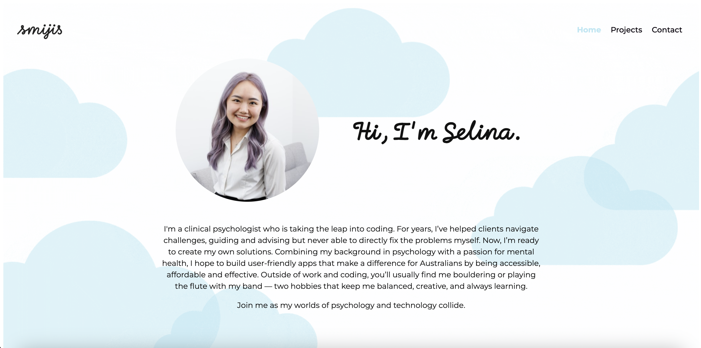

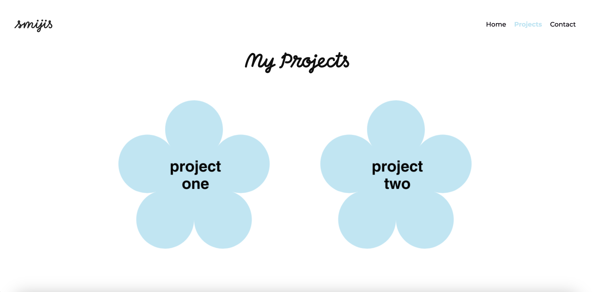
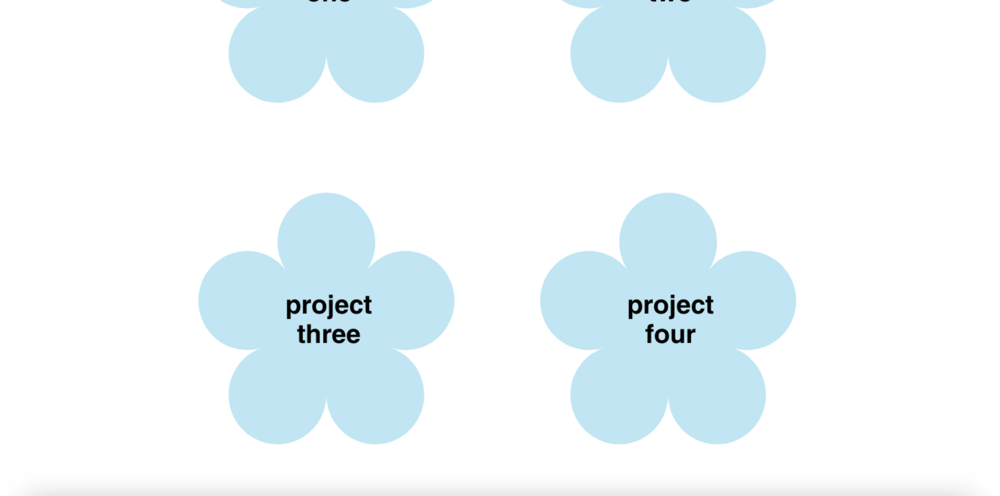
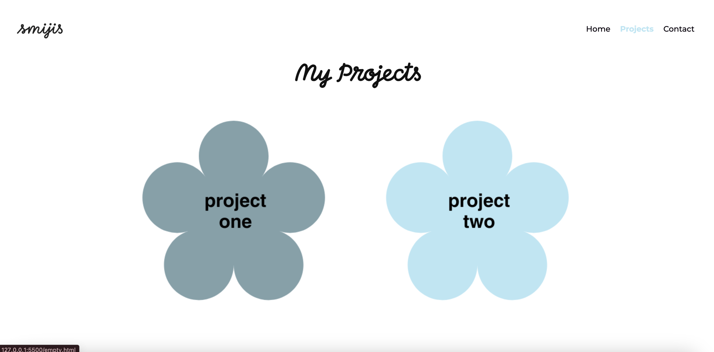

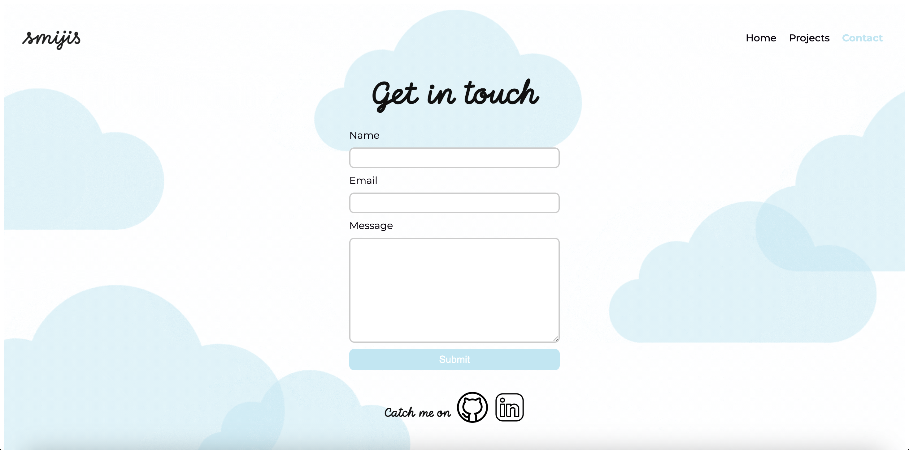
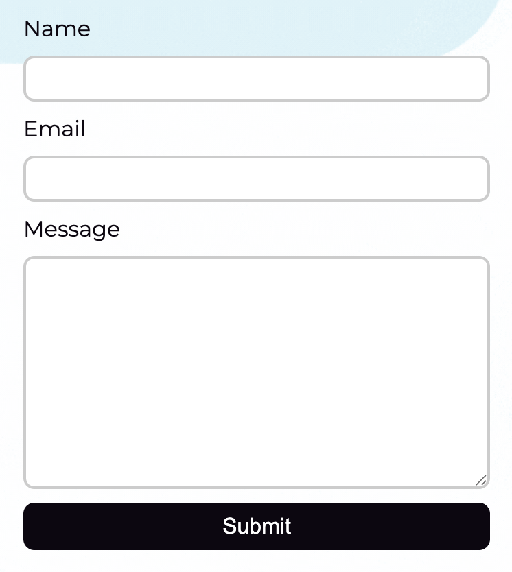

#### iPad Air (820 x 1180)

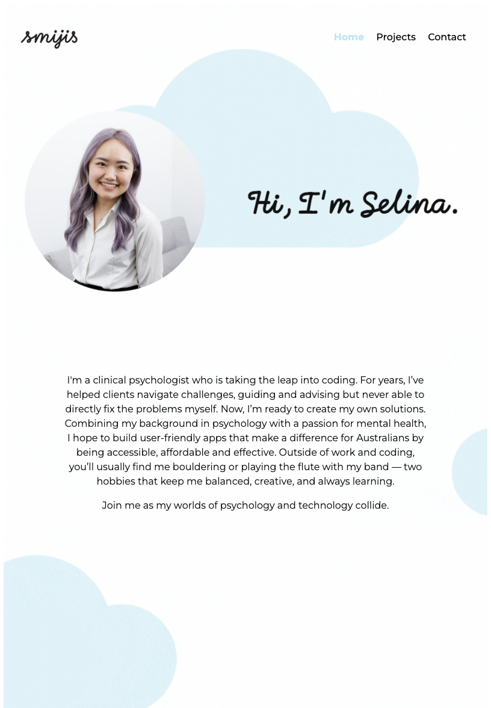
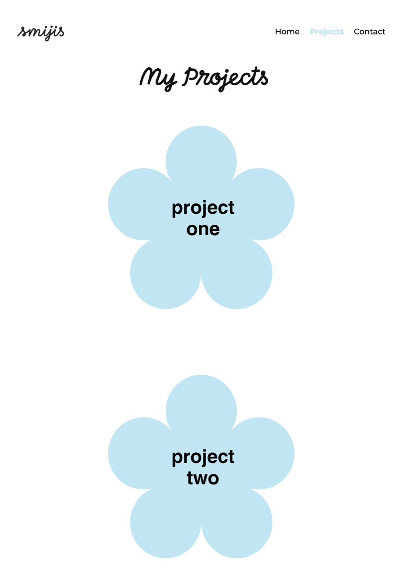
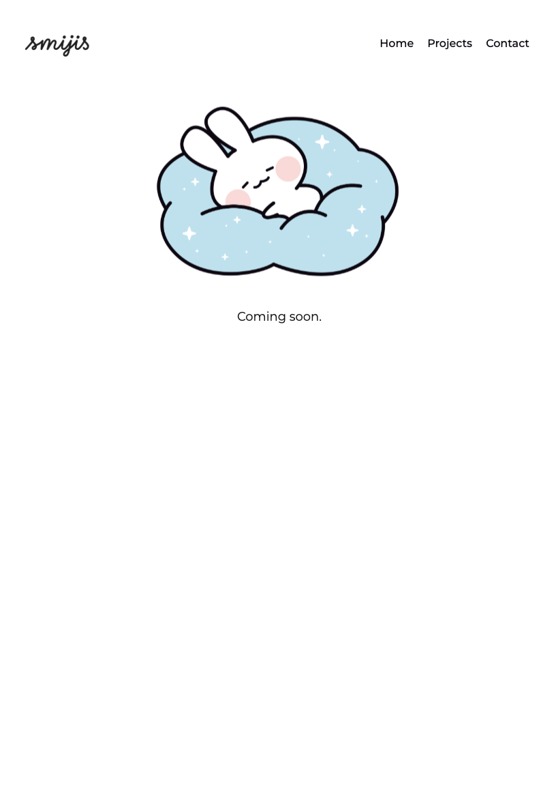
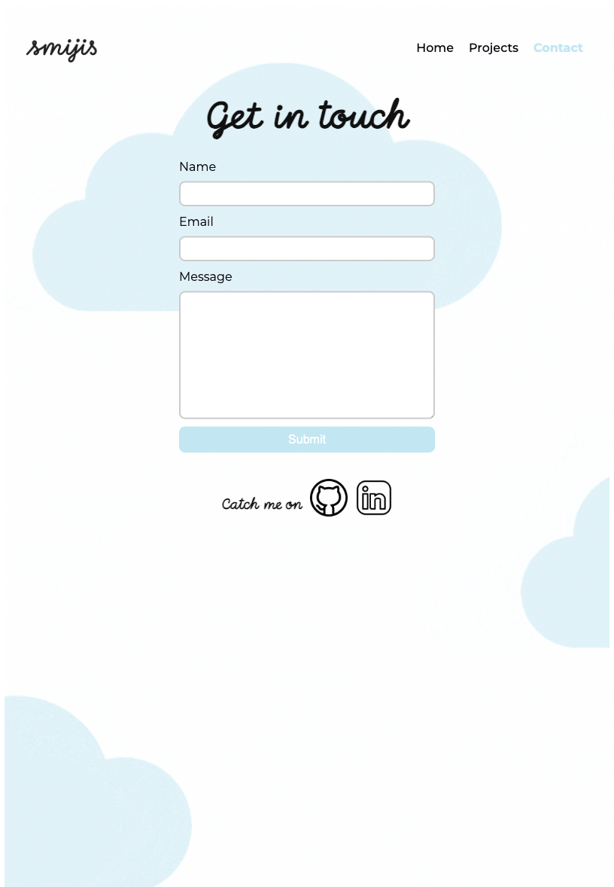

#### mobile (Pixel7) (412 x 915)

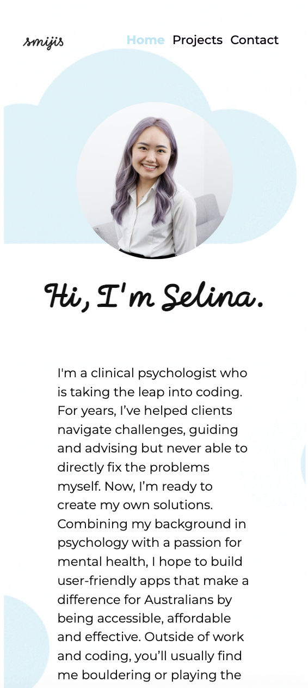
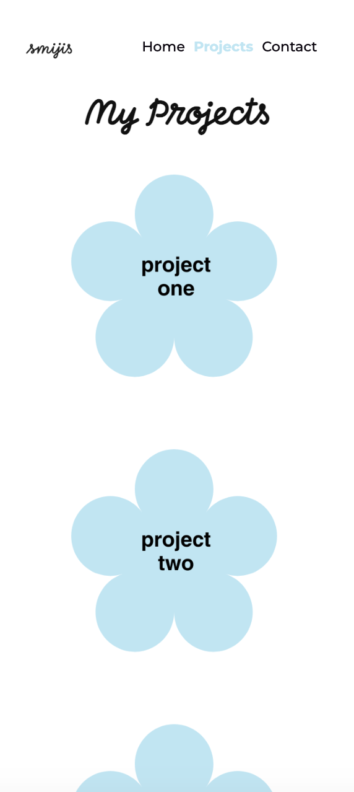
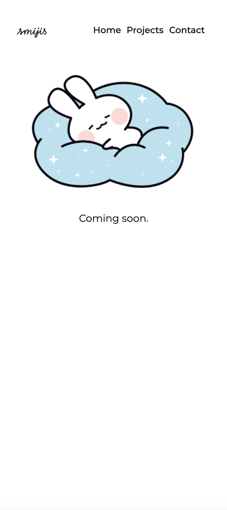

#### wireframe

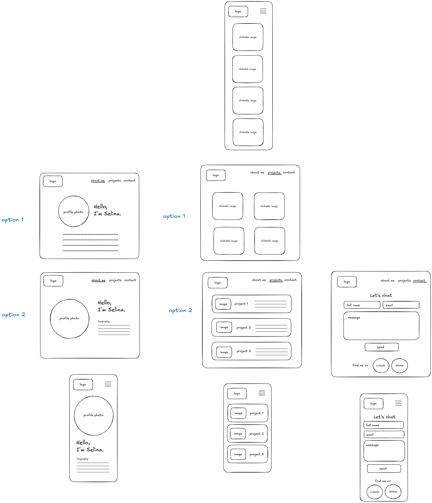
